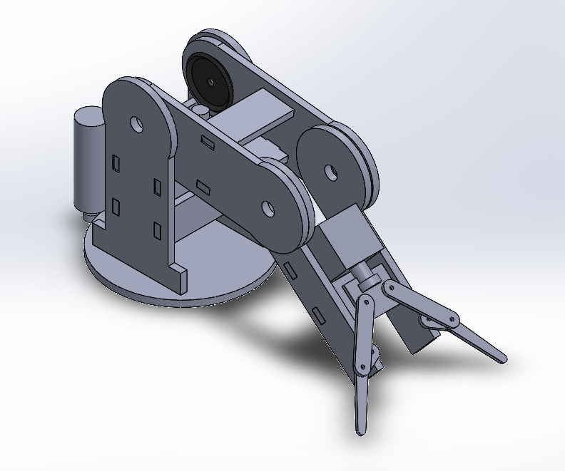
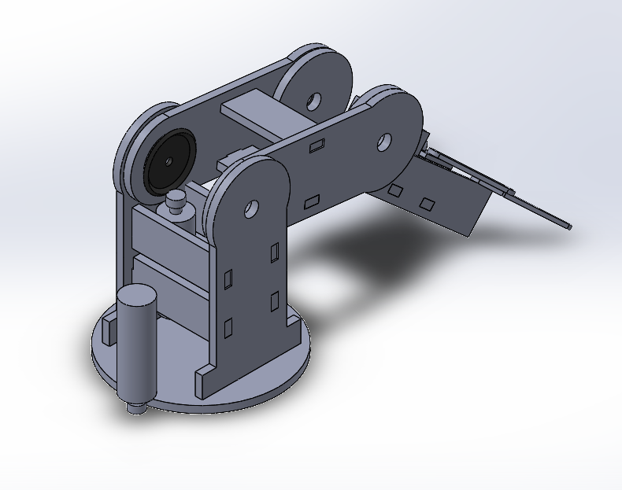

# The Arm Game

Jacob Bograd, Nick De Simone, Horacio Albarran

## Proposal

Our goal is to create a robotic arm that a user can control using a game controller. The Controller will communicate to the host computer over a library from GitHub. The Host controller will then interoperate the controller inputs and send them to the Nucleo. The Nucleo will read the inputs and update the respective motor PWM values. The Nucleo will then send the encoder values back to the computer. All of the calculations will be handled on the computer side the Nucleo will only be setting the PWM values for the respective motors. 

## Calibration

The arm will contain a calibrate function that will zero the base by lining up a magnet with a hall effect sensor. Once the base is calibrated the arm will go to the minimum value and set the encoder value to be zero.

# Bill of materials

| Qty. | Part                  | Source                | Est. Cost |
|:----:|:----------------------|:----------------------|:---------:|
|  2   | Pittperson Gearmotors | ME405 Tub             |     -     |
|  1   | Nucleo with Shoe      | ME405 Tub             |     -     |
|  1   | Solenoid              | DigiKey               |   4.95    |
|  1   | Solenoid Driver       | ???????               |   ??????  |
|  2   | Arms                  | ????????              |   ??????  |
|  1   | Game Controller       | Jacob's Toolbox       |   59.99   |
|  ?   | Gears                 | ????????              |   ??????  |

# Part List

Solenoid ROB-11015 https://www.digikey.com/en/products/detail/sparkfun-electronics/ROB-11015/6163694
3.5mm Stroke, 80 g force (Yes I hate those units too)

Pittperson Gearmotors https://www.ebay.com/itm/144350295705?hash=item219bf2b699:g:6eIAAOSwj59hzPha

# System Sketch

