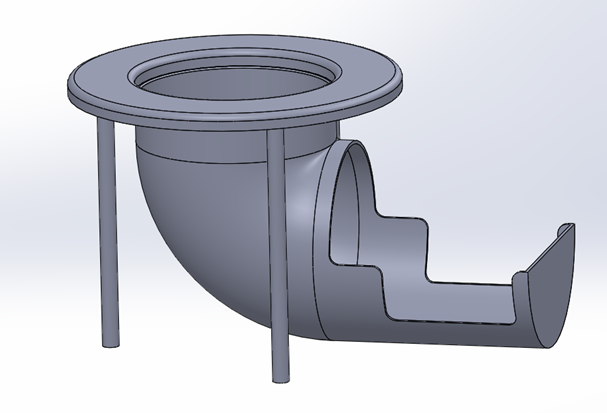

# The Arm Game

Jacob Bograd, Nick De Simone, Horacio Albarran

## Documentation
 https://me-405.github.io/The-Arm-Game/

## Proposal

Our goal is to create a robotic arm that a user can control using a game controller. The Controller will communicate to the host computer over a library from GitHub. The Host controller will then interoperate the controller inputs and send them to the Nucleo. The Nucleo will read the inputs and update the respective motor PWM values. The Nucleo will then send the encoder values back to the computer. All of the calculations will be handled on the computer side the Nucleo will only be setting the PWM values for the respective motors. 

## Calibration

The arm will contain a calibrate function that will zero the base by lining up a magnet with a hall effect sensor. Once the base is calibrated the arm will go to the minimum value and set the encoder value to be zero.

## Controller Library - UNDER CONSTRUCTION
Currently under development. 
Implementing the open source library pydualsense under the MIT license. This library will be used to read the current state of the controller. The library will also be used to set custom trigger states to use the dualsense features.

## Install Open Source Libraries
To install the pydualsense use the following command, make sure the x64 folder is in the directory
`pip install pydualsense`

# Bill of materials

| Qty. | Part                        | Source                | Est. Cost |
|:----:|:----------------------------|:----------------------|:---------:|
|  2   | Pittperson Gearmotors       | ME405 Tub             |     -     |
|  1   | Nucleo with Shoe            | ME405 Tub             |     -     |
|  4   | MG996R Servos[Package]      | Amazon                |   26.99   |
|  4   | SG90 Micro Servo [Package]  | Amazon                |  Unknown  |
|  1   | Arm Structure and Base      | Bonderson's Building  |     -     |
|  1   | Game Controller             | Jacob's Toolbox       |   59.99   |
|  1   | Gear [If needed]            | 3-D printed           |     -     |
|  7   | M4 bolt and nuts            | Ace Hardware          |     -     |
|  1   | Ping Pong ball              | Undefined             |     -     |

# Part List
Pittperson Gearmotors https://www.ebay.com/itm/144350295705?hash=item219bf2b699:g:6eIAAOSwj59hzPha

# System Sketch

# Catching Table Sketch
The following model was constructed to be able to catch the ping pong ball in a safe manner.

