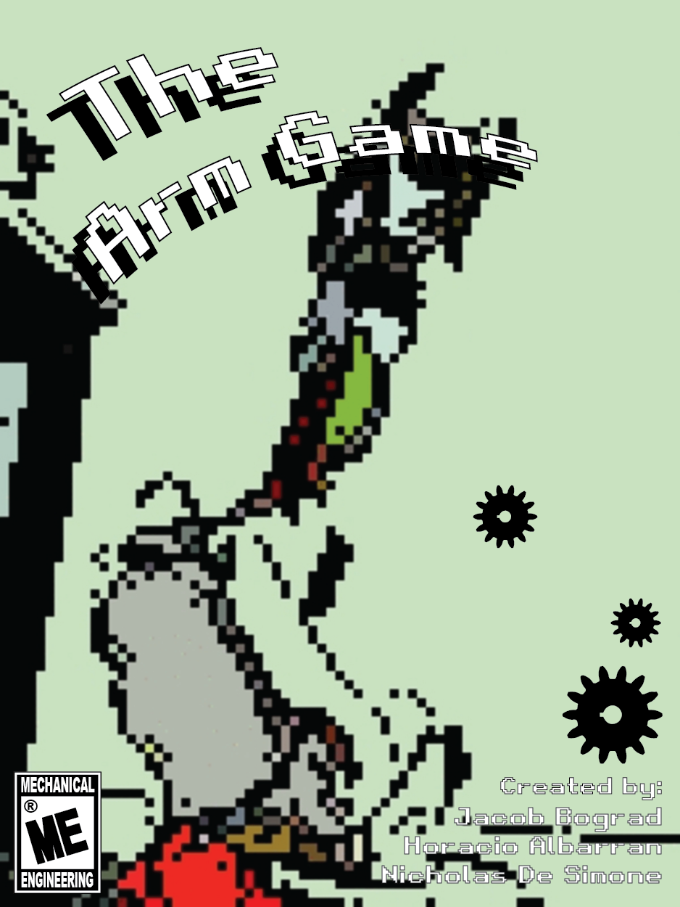
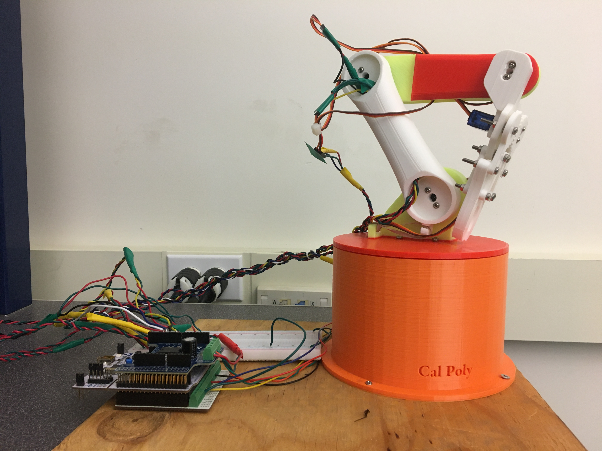
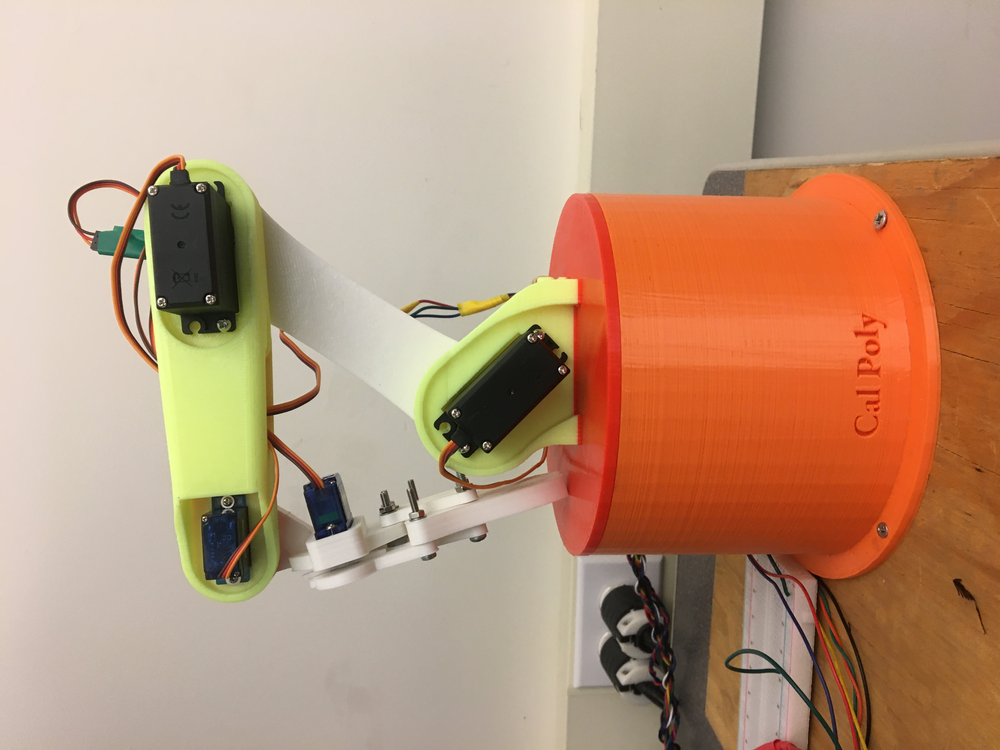

# The Arm Game

Jacob Bograd, Nick De Simone, Horacio Albarran

## Introduction

Our 3D-printed robotic arm is manipulated using a game controller, where the goal in using the arm is to grab a ping-pong ball and drop it through the "catching tables". The game controller communicates to the host computer over a library obtained through GitHub, and the PC interprets the controller inputs as desired end effector locations and sends them to a l476RG Nucleo. The Nucleo reads the given input arguments as x,y, and z-coordinates and transforms them into respective motor PWM values, which correspond to necessary angular positions for the servos. The Nucleo also sends the DC motor's encoder values back to the computer. All of the calculations are handled on the computer side, such that the Nucleo only sets PWM values for the respective motor and/or servos in order to get to the specified position for the claw at the end of the robotic arm. 

## Documentation and Software Design

There are ten .py files for the micro-controller side of the controller program. Such files allow for closed loop control of the used motor as well as providing with the required calculations in order to operate the arm, elbow, and clamping mechanism of the links.  
On the other hand, there is one required file on the computer side in order to open the console for the game controller to be used and provide with the desired x,y, and z-coordinates of the desired point in space where the claw must be located in order to grab the desired object, in this case, a ping-pong ball.
For further information, please refer to the following link for any documentation regarding "The Arm Game" project:

https://me-405.github.io/The-Arm-Game/

## Calibration
!! \
PROBABLY DONT NEED THIS SECTION. IT IS NOT CORRECT ANYMORE, WE DID NOT ZERO THE BASE \
!! \
The arm will contain a calibrate function that will zero the base. Once the base is calibrated the arm will go to the minimum value and set the encoder value to be zero in order to the to a position specified as "its origin" initial position.

## Wiring Keys
### Power
Red electrical Tape - 12V Motor \
Yellow electrical Tape - 7V Servo \
Green Electrical Tape  - 5V MicroServo \
Blue with Green - GND \
Black with Yellow - 7V

### Data
White - Servo0 \
Blue - Servo1 \
Black - Servo2\
Yellow - Servo3

### Data Nucleo Pins
PA5 - Servo0 \
PA6 - Servo1 \
PA7 - Servo2\
PC7 - Servo3

# Bill of materials

| Qty. | Part                                 | Source                | Est. Cost |
|:----:|:-------------------------------------|:----------------------|:---------:|
|  1   | Pittperson Gearmotors                | ME405 Tub             |     -     |
|  1   | l476RG Nucleo with Shoe              | ME405 Tub             |     -     |
|  2   | MG996R Servos[Package]               | Amazon                |   26.99   |
|  2   | SG90 Micro Servo [Package]           | Amazon                |   10.69   |
|  1   | Arms, Base, & Waist [3-D printed]    | Bonderson's Building  |     -     |
|  1   | Game Controller [PS5 controller]     | Jacob's Toolbox       |   59.99   |
|  1   | Gear                                 | 3-D printed           |     -     |
| 10+  | Assorted metric bolt and nuts        | Ace Hardware          |     -     |
|  1   | Ping-Pong ball                       | Found                 |     -     |

# Part List
!! \
PROBABLY DONT NEED THIS SECTION, IF WE KEEP IT WE SHOULD INCLUDE THE REST OF THE PARTS \
!! \
Pittperson Gearmotors 

https://www.ebay.com/itm/144350295705?hash=item219bf2b699:g:6eIAAOSwj59hzPha

# Images
## System Assembly
The following images display an overview of the 3D printed hardware design. 

Figure 1: Overall system assembly. Includes complete arm mechanism on the right and microcontroller stack to the left.

Figure 2: Servo locations.

Figure 3: Open-view of the base. Note (1) the internal DC-motor, which mates to the waist's gear with a 7:1 gear ratio and (2) the center-most shaft for mounting of the arm/waist assemblies.

## Catching Table Sketch
The following model was constructed to be able to catch the ping-pong ball in an effective manner.

# Testing
System testing allowed us to observe physical constraints of the assembly and control them accordingly.
To begin, each component of the systems was tested individually (i.e. unique PWM signals were sent to each motor to ensure they behaved appropriately). 
An important component to testing became linkage alignment; we fixed the printed arms to the servo end effectors at strategic starting positions, such that each 
0-180 degree servo position produces desirable arm orientations.

We would like to note that communicating to a second terminal through the upper-most UART port on the microcontroller stack was a helpful feature in testing, as it allowed
for viewable debug statements from the Nucleo while busy sending actuation locations over its bottom-most USB-VCP port.
The mechanism did ultimately have undesirable behavior, which may be observed at length in the "Recommendations" section.

## Recommendations
It is important to note that, in our attempt to compute linkage angles according to a desired end effector location, our use of inverse kinematics control sometimes
produced unfavorable singularities in the arm's motion. Likely, our source of error stemmed from our application of a 2 degree-of-freedom, 2-link inverse kinematic
model to our controller, whereas, in practice, our robot arm has 3 degrees-of-freedom (not accounting for the gripper's pitch or close, as these were not included in our 
defined end effector location, i.e. the "end effector location" refers to the gripper wrist). Subsequent research into this error has suggested that the computation of 
linkage angles from an inputted end effector location may result in two unique orientations of the robot arm- either in the "elbow up" or "elbow down" configuration- at 
times producing undesired behavior. For example, when transistioning between specific points in space, the arm underwent rapid transition from "elbow up" to 
"elbow down", sometimes crashing the bot into the table or other times producing large inertial moments on the gripper assembly, causing it to snap at the end of its motion.
Possible solutions may include (1) proper consideration of and selection between the two unique orientation solutions found by our motor controller/kinematic solver scripts,
or (2) implementation of alternative controller methods, such as the Newton Raphson. The Newton Method may be more suited for our system because the arm has more than two DOF's.

We also found limits on the arms actuation in the radial direction due to insufficient fixturing/support at the base of the arm. Resultant undesired behavior included the arm
"jumping off" its orange base when actuating at a large radial distance (close to the length of both arms extended horizontally). Possible solutions include (1) fixing the
gear (currently attached on the undermost surface of the revolving waist) to both the orange base and the revolving waist, or (2) attaching physical masses to the
waist to counteract force moments when actuating in the downward direction.

It would also be recommended to obtain servos with higher output torque, as the 7V servos had difficulty sustaining the mechanism's weight. The microservos were able to
control gripper pitch and close without issue.

## Structural Components
Please refer to the following link for the 3D-printed structual components:

https://github.com/ME-405/The-Arm-Game/tree/main/Hardware_Components

## Video of Functioning Mechanism
The following video provides with the final functioning of the mechanism: 

https://user-images.githubusercontent.com/97562028/157779387-043f62d6-f68d-46a5-b4d3-32e55e5b0366.mp4

